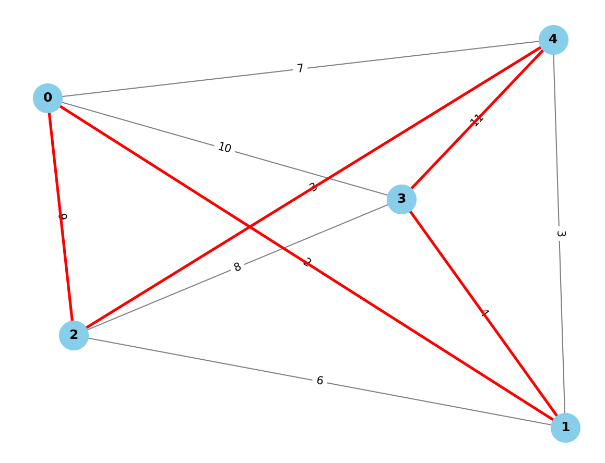
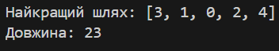

# ACO_algo
- Для роботи нам необхідно встановити бібліотеки **numpy** i **random**:
```
pip install numpy
pip install random
```

- за допомогою бібліотеки **matplotlib** і **networkx** можна відобразити резульат на графі, де ваги графа вказують на відстань. 

## Мета

Реалізувати мурашиний алгоритм для пошуку найкоротшого маршруту.

### Яку задачу вирішує?
Задача полягає у знаходженні найкоротшого маршруту, що проходить через усі міста один раз і повертається в початкову точку. Це класична задача комівояжера, в якій мінімізується загальна відстань маршруту.

### Які дані на вході?
На вхід алгоритму подаються наступні параметри:
- **NUM_ANTS**: Кількість мурах для пошуку маршруту.
- **NUM_CITIES**: Кількість міст у задачі.
- **ALPHA** та **BETA**: Вплив феромонів та відстані (видимості) на вибір шляху.
- **EVAPORATION_RATE**: Швидкість випаровування феромонів після кожної ітерації.
- **Q**: Константа для збільшення кількості феромонів на коротких маршрутах.
- **NUM_ITERATIONS**: Кількість ітерацій алгоритму.

### Що на виході?
На виході алгоритм повертає:
- **Найкоротший знайдений шлях** — порядок міст, що мінімізує загальну відстань маршруту.
- **Довжину найкоротшого шляху** — мінімальну відстань, знайдену алгоритмом для даного набору міст.

